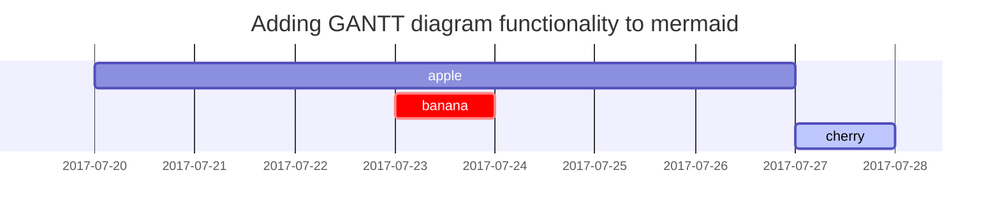

这篇文章目的是展示  [**Chirpy**](https://github.com/cotes2020/jekyll-theme-chirpy/fork) 支持的 Markdown 语法渲染，可以作为写作的模版，作为行文和排版的参考。


## 标题
---
# 一级标题

## 二级标题

### 三级标题

#### 四级标题

## 段落

I wandered lonely as a cloud  // 我独自漫步，如同一朵云，

That floats on high o'er vales and hills,  // 漂浮于山谷和山丘之上

When all at once I saw a crowd,  // 当突然间我看到了一群，

A host, of golden daffodils;  // 一群金色的水仙花；

Beside the lake, beneath the trees,  // 它们在湖畔，树下，

Fluttering and dancing in the breeze.  // 随风飘动，跳跃舞动。

## 列表

### 有序列表

1. Firstly
2. Secondly
3. Thirdly

### 无序列表

- Chapter
	- Setcion
      - Paragraph

### 任务列表

- [ ] TODO
- [x] Completed
- Hold on
- [ ] Defeat COVID-19
  - [x] Vaccine production
  - [ ] Economic recovery
  - [ ] People smile again

### Description list

Sun
: the star around which the earth orbits

Moon
: the natural satellite of the earth, visible by reflected light from the sun


## Block Quote

> This line to shows the Block Quote.

## Tables

| Company                      | Contact          | Country |
|:-----------------------------|:-----------------|--------:|
| Alfreds Futterkiste          | Maria Anders     | Germany |
| Island Trading               | Helen Bennett    | UK      |
| Magazzini Alimentari Riuniti | Giovanni Rovelli | Italy   |

## Links

<http://127.0.0.1:4000>


## Footnote

Click the hook will locate the footnote[^footnote], and here is another footnote[^fn-nth-2].


## Images

- Default (with caption)


_Full screen width and center alignment_

<br>

- Specify width

{: width="400"}
_400px image width_

<br>

- Left aligned

{: width="350" .normal}

<br>

- Float to left

  {: width="240" .left}
  "A repetitive and meaningless text is used to fill the space. A repetitive and meaningless text is used to fill the space. A repetitive and meaningless text is used to fill the space. A repetitive and meaningless text is used to fill the space. A repetitive and meaningless text is used to fill the space. A repetitive and meaningless text is used to fill the space. A repetitive and meaningless text is used to fill the space. A repetitive and meaningless text is used to fill the space. A repetitive and meaningless text is used to fill the space. A repetitive and meaningless text is used to fill the space. A repetitive and meaningless text is used to fill the space. A repetitive and meaningless text is used to fill the space."

<br>

- Float to right

  {: width="240" .right}
  "A repetitive and meaningless text is used to fill the space. A repetitive and meaningless text is used to fill the space. A repetitive and meaningless text is used to fill the space. A repetitive and meaningless text is used to fill the space. A repetitive and meaningless text is used to fill the space. A repetitive and meaningless text is used to fill the space. A repetitive and meaningless text is used to fill the space. A repetitive and meaningless text is used to fill the space. A repetitive and meaningless text is used to fill the space. A repetitive and meaningless text is used to fill the space. A repetitive and meaningless text is used to fill the space. A repetitive and meaningless text is used to fill the space."

<br>

## Mermaid SVG




## Mathematics

The mathematics powered by [**MathJax**](https://www.mathjax.org/):

$$ \sum_{n=1}^\infty 1/n^2 = \frac{\pi^2}{6} $$

When $a \ne 0$, there are two solutions to $ax^2 + bx + c = 0$ and they are

$$ x = {-b \pm \sqrt{b^2-4ac} \over 2a} $$


## Inline code

This is an example of `Inline Code`.


## Code block

### Common

```
This is a common code snippet, without syntax highlight and line number.
```

### Specific Languages

#### Console

```console
$ env |grep SHELL
SHELL=/usr/local/bin/bash
PYENV_SHELL=bash
```

#### Ruby

```ruby
def sum_eq_n?(arr, n)
  return true if arr.empty? && n == 0
  arr.product(arr).reject { |a,b| a == b }.any? { |a,b| a + b == n }
end
```

#### Shell

```shell
if [ $? -ne 0 ]; then
    echo "The command was not successful.";
    #do the needful / exit
fi;
```

#### Liquid


```liquid

  This product's title contains the word Pack.

```


#### Java

```java
private void writeObject(java.io.ObjectOutputStream s)
  throws java.io.IOException {
  // Write out any hidden serialization magic
  s.defaultWriteObject();
  for (E e: map.keySet()) s.writeObject(e);
}
```

## Reverse Footnote

[^footnote]: The footnote source
[^fn-nth-2]: The 2nd footnote source
